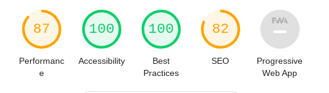
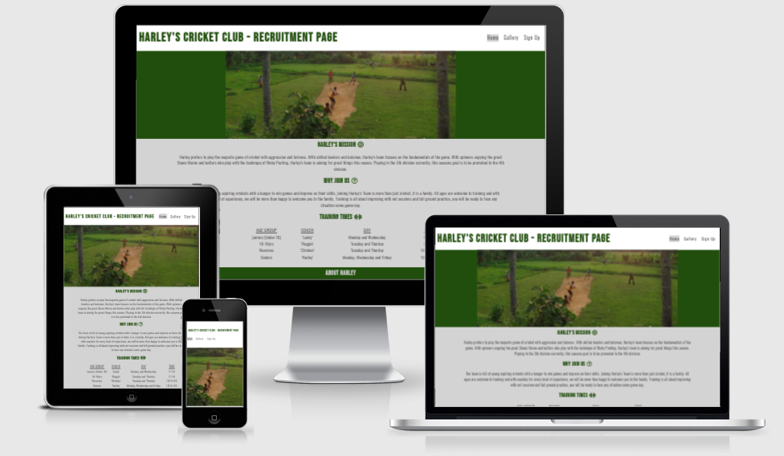

# **Harley's Cricket Club - Recruitment Page**

This page is designed for new recruits who wish to join Harley's team. It has training times and a small biography of Harley. All new recruits will be given this site as a starting point and through the [Sign Up](sign-up.html) page, can register intrest in joining the team. A [Gallery](gallery.html) has been added to show pictures of cricket being played by Harley's Team.

## **Testing**

HTML and CSS testing was done through `W3C` validator:

- [Home Page](index.html) had 2 issues with not having headings in a section tag.

- [Gallery Page](gallery.html) had 2 issues with not having headings in a section tag.

- [CSS stylesheet](style.css) has no issues 

Both issues have been delibarated on and the page does not require headings at these points

## **Lighthouse Score**

## **Responsive Design**

## **Features**

### Navigation
- The navigation section is placed at the top left of every page in full desktop viewing and floats left under the heading on a smaller screen size. 
- The navigation links increase in size when hovered over to assist users throughout the page
- On the [Welcome](welcome.html) page, the image has a link back to the home page.
- The main heading is also a link to the home page.

### Gallery
- The [Gallery](gallery.html) is designed to maximize the viewers interest. 
- Using media queries, the gallery reduces in columns to optimize viewing pleasure on smaller devices.

## **Bugs**
- I fixed many bugs in the page as I was working on them, these have been mentioned within each `git commit` I have done.
- I removed extra closing tags and fixed bugs that `W3C` showed me too.
- There are no bugs left unattended in the site

## **Deployment**
- I deployed my site on GitHub pages. I followed instructions from [Code Institue](https://codeinstitute.net/se/5-day-coding-challenge/?utm_term=code%20institute&utm_campaign=CI+-+SWE+-+Search+-+Brand&utm_source=adwords&utm_medium=ppc&hsa_acc=8983321581&hsa_cam=14660337051&hsa_grp=134087657984&hsa_ad=546251838233&hsa_src=g&hsa_tgt=kwd-319867646331&hsa_kw=code%20institute&hsa_mt=e&hsa_net=adwords&hsa_ver=3&gclid=Cj0KCQiA15yNBhDTARIsAGnwe0UQv6qv0SwHT3sAGJ6uF8SdJR6nThPCUkVs_yMLPFdVaHSEq1RtzB8aAtAuEALw_wcB) and deployed my site.
- My deployed site url is [https://scottquinn144.github.io/project-one/index.html](https://scottquinn144.github.io/project-one/index.html)

## **Credits**

### Content
- Harley Smith for providing me with his biography information

### Media
- All images were taken from [Google](https://www.google.com/)

## **Disclaimer**

This site was built for educational purposes only, all rights to images remain with the copyright owners. `Harley's Team` is a fictional team based on the developers personal friend. Harley gave permission to use his name and biography for this site. Any real team with the same name or likeness holds copyrights to the name and likeness. 

Developer: Scott Quinn

